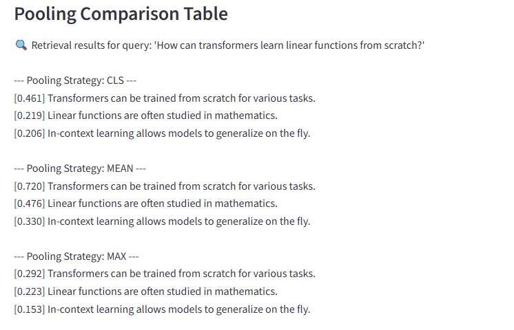
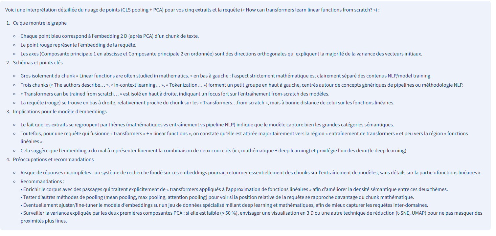

# Raglens: Visual Diagnostics for Embedding Models in RAG Pipelines

Raglens is a visual, CLI, and UI-based diagnostic toolkit designed to inspect and compare embedding models in Retrieval-Augmented Generation (RAG) systems. It allows you to probe token-level and chunk-level representations, assess pooling strategies, analyze similarity matrices, and understand how embeddings change across model layers. Optionally, you can generate AI-powered explanations for each plot in your preferred language using LLMs.

---

## Installation

You can install Raglens from PyPI or from source, using either `pip` or the [uv package manager](https://github.com/astral-sh/uv):

### From PyPI (recommended for most users)

#### Using pip

```bash
pip install raglens
```

#### Using uv

```bash
uv pip install raglens
```
or
```bash
uv add raglens
```

### From source (for development)

First, clone the repository:

```bash
git clone https://github.com/gegedenice/raglens.git
cd raglens
```

#### Using pip

```bash
pip install -e .
```

#### Using uv

```bash
uv pip install -e .
```

If you need to install dependencies from `requirements.txt`:

```bash
uv pip install -r requirements.txt
```

You can use `uv` as a drop-in replacement for `pip` in all commands throughout this README.

## Features Overview

### Token-Level Diagnostics

- **`plot_token_geometry`**: Projects token embeddings into 2D using PCA or UMAP. Reveals how tokens are distributed in embedding space, helping you understand semantic clustering and outliers.
- **`compare_pooling_methods`**: Visualizes and compares CLS, mean, and max pooling strategies for sentence embeddings. Useful for selecting the most representative pooling method for downstream tasks.
- **`layerwise_token_drift`**: Shows how selected token representations evolve across transformer layers. Helps diagnose how information propagates and transforms through the model.
- **`embedding_distribution_stats`**: Plots distributional statistics (e.g., L2 norms, explained variance) for token embeddings. Useful for detecting anomalies or understanding embedding magnitude and variance.

### Chunk-Level Diagnostics

- **`chunking_sanity`**: Inspects how tokenization splits long texts into chunks. Highlights chunk boundaries and overlap, ensuring proper chunking for retrieval.
- **`plot_chunk_geometry`**: Scatter plots chunk embeddings (optionally with a query) in 2D space, colored by pooling strategy. Reveals chunk clustering and query proximity.
- **`semantic_similarity_matrix`**: Displays a heatmap of inter-sentence or inter-chunk similarities. Useful for visualizing semantic relationships and redundancy.

### Retrieval Diagnostics

- **`compare_retrieval_pooling`**: Visualizes the impact of different pooling strategies on top-k chunk retrieval. Helps you select the best pooling method for retrieval accuracy.

### LLM-based Interpretation (Optional)

- **`--generate-explanation`**: Adds AI-generated interpretation of the plots using OpenAI or Hugging Face APIs.
- **`--language`**: Selects the language for LLM explanations (e.g., English, French, Spanish).
- Requires setting an environment variable or `--api-key` flag with your access key.

--- 

## EmbeddingModel Class

Raglens uses a flexible embedding interface:

```python
from raglens.embeddings import EmbeddingModel
model = EmbeddingModel(model_name="sentence-transformers/all-MiniLM-L6-v2")
```

### Optional: Custom Model Storage

```python
model = EmbeddingModel(model_name="...", model_dir="./my_models")
```

### Automatic Strategy Support Detection

```python
print("Supported pooling strategies:", model.get_supported_strategies())
```

---

## Model Compatibility

Supports any HuggingFace-compatible encoder-based transformer model. Pooling strategies adapt based on architecture (e.g., CLS only enabled if present).
---

## Function Reference

### Token-Level

- **plot_token_geometry**: Visualizes token embeddings in 2D (PCA/UMAP). Shows semantic clusters and outliers.
- **compare_pooling_methods**: Compares sentence-level embeddings from different pooling strategies.
- **layerwise_token_drift**: Tracks how specific tokens change across model layers.
- **embedding_distribution_stats**: Plots L2 norms and explained variance for embeddings.

### Chunk-Level

- **chunking_sanity**: Shows how text is split into chunks, highlighting overlaps and boundaries.
- **plot_chunk_geometry**: Plots chunk embeddings and optionally a query, showing their spatial relationships.
- **semantic_similarity_matrix**: Heatmap of similarities between chunks.

### Retrieval

- **compare_retrieval_pooling**: Compares retrieval results for different pooling strategies, visualizing top-k matches.

### LLM Explanation

All plotting functions support `generate_explanation=True` and `language="..."` for AI-powered, language-specific plot interpretation.

---

## How to Use LLM Explanations

- Set `--generate-explanation` in CLI or `generate_explanation=True` in Python.
- Set `--language` in CLI or `language="..."` in Python.
- Provide your API key via `--api-key` or environment variable.
- The explanation will be generated in your chosen language and printed after each plot.

---

## CLI Usage

```bash
python cli/main.py --mode <mode> [options]
```

### Modes and Arguments

| Mode                  | Required Input                 | Description                         |
| --------------------- | ------------------------------ | ----------------------------------- |
| `token-geometry`      | `--text`                       | Token PCA/UMAP visualization        |
| `pooling-compare`     | `--text`                       | Compare pooling embeddings          |
| `embedding-stats`     | `--text`                       | Show distribution stats             |
| `token-drift`         | `--text` + prompt              | Token evolution through layers      |
| `semantic-similarity` | `--chunks` (list)              | Similarity matrix                   |
| `chunk-geometry`      | `--chunks` (list)              | Chunk scatter plot w/ query         |
| `chunk-sanity`        | `--chunks` (list)              | Inspect token-based chunking        |
| `retrieval-compare`   | `--chunks` + `--query`         | Retrieval across pooling strategies |

#### Common Options

- `--generate-explanation`: If set, returns an LLM-generated explanation for each plot (default LLM is OpenAI o4-mini model).
- `--language`: Specify the language for explanations (default: English).
- `--api-key`: Your OpenAI API key (can also be set via `OPENAI_API_KEY` environment variable).

### Example:

```bash
python cli/main.py --mode token-geometry --text "Learning is a continuous journey." --generate-explanation --language French --api-key sk-xxx
```
---

## Notebook & Script Examples

### Demo Notebook

Explore all features interactively in `notebooks/01_demo.ipynb`. The notebook guides you through:

1. Visualizing token embeddings (PCA/UMAP)
2. Comparing pooling strategies
3. Exploring layerwise drift
4. Plotting chunk-level geometry
5. Inspecting retrieval results
6. Generating LLM explanations in your chosen language

### Example Script

See `scripts/plot_example.py` for a step-by-step CLI demo. The script:

- Prompts for your preferred explanation language and API key
- Sequentially runs each diagnostic, asking for confirmation before each step
- Displays each plot and its LLM-generated explanation (if enabled)
- Keeps user control and clarity throughout the process

---

## Streamlit UI

A user-friendly interactive app is available in [`ui/streamlit_app.py`](ui/streamlit_app.py):

- **All features accessible via tabs:** Token geometry, pooling comparison, layerwise drift, embedding stats, chunking sanity, chunk geometry, semantic similarity, and retrieval diagnostics.
- **Model selection and API key input:** Choose your embedding model, storage directory, and provide your OpenAI API key.
- **Language selection for explanations:** Choose the language for LLM-generated plot explanations.
- **Clear descriptions:** Each tab includes a short paragraph (in English and French) explaining the purpose of the visualization.
- **No code required:** Run with `streamlit run ui/streamlit_app.py` and explore all diagnostics visually.
- **Smart output capture:** Functions that print to stdout (like `chunking_sanity` and `compare_retrieval_pooling`) are captured and displayed in the UI.

### Example Usage

```bash
streamlit run ui/streamlit_app.py
```

### Details

- **Tabs for each diagnostic:** Each tab runs a specific visualization or analysis, with a clear description and input fields.
- **Model and API settings:** Select model, directory, API key, and explanation language in the sidebar.
- **Smart output capture:** Functions that print to stdout are captured and shown in the UI.
- **Internationalization-ready:** Tab descriptions support both English and French (via the `help` argument).
- **Easy to extend:** Add new diagnostics or explanations by adding new tabs.

### Screenshots






---

## License

MIT License

---

## Further Reading

- See `notebooks/01_demo.ipynb` for a full workflow.
- Try `scripts/plot_example.py` for a guided CLI demo.
- Explore the codebase for extensibility and advanced diagnostics.
- Use `ui/streamlit_app.py` for a full-featured, interactive visual experience.